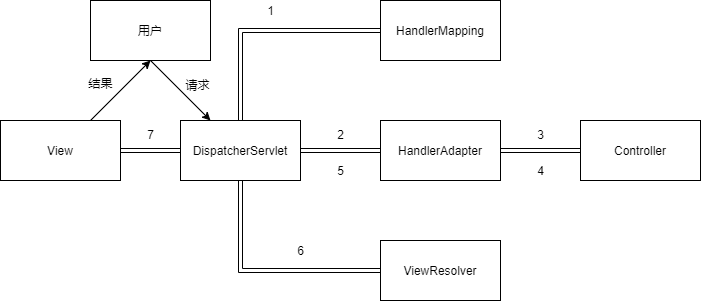
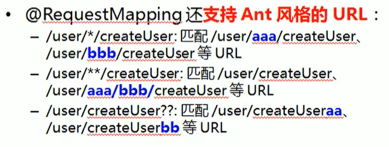

## 回顾MVC

### 什么是MVC

- MVC是模型(Model)、视图(View)、控制器(Controller)的简写，是一种软件设计规范。
- 是将业务逻辑、数据、显示分离的方法来组织代码。
- MVC主要作用是**降低了视图与业务逻辑间的双向偶合**。
- MVC不是一种设计模式，**MVC是一种架构模式**。当然不同的MVC存在差异。

**Model（模型）：**数据模型，提供要展示的数据，因此包含数据和行为，可以认为是领域模型或JavaBean组件（包含数据和行为），不过现在一般都分离开来：Value Object（数据Dao） 和 服务层（行为Service）。也就是模型提供了模型数据查询和模型数据的状态更新等功能，包括数据和业务。

**View（视图）：**负责进行模型的展示，一般就是我们见到的用户界面，客户想看到的东西。

**Controller（控制器）：**接收用户请求，委托给模型进行处理（状态改变），处理完毕后把返回的模型数据返回给视图，由视图负责展示。也就是说控制器做了个调度员的工作。

**最典型的MVC就是JSP + servlet + javabean的模式。**

### 回顾Servlet

1. 编写一个Servlet类，用来处理用户的请求

    ```java
    import javax.servlet.ServletException;
    import javax.servlet.http.HttpServlet;
    import javax.servlet.http.HttpServletRequest;
    import javax.servlet.http.HttpServletResponse;
    import java.io.IOException;

    /**
     * @author ChenZT
     */
    public class HelloServlet extends HttpServlet {
        protected void doPost(HttpServletRequest request, HttpServletResponse response) throws ServletException, IOException {
            doGet(request,response);
        }

        protected void doGet(HttpServletRequest request, HttpServletResponse response) throws ServletException, IOException {
            // 获取前端参数
            String method = request.getParameter("method");
            if (method.equals("add")){
                request.getSession().setAttribute("msg","执行了add方法");
            }
            if (method.equals("delete")){
                request.getSession().setAttribute("msg","执行了delete方法");
            }
            // 调用业务层，暂时没有
            // 视图跳转，要在对应路径位置创建一个jsp文件
            request.getRequestDispatcher("/WEB-INF/views/test.jsp").forward(request,response);
        }
    }
    ```

2. 在web.xml中注册Servlet

    ```xml
    <servlet>
        <servlet-name>HelloServlet</servlet-name>
        <servlet-class>HelloServlet</servlet-class>
    </servlet>
    <servlet-mapping>
        <servlet-name>HelloServlet</servlet-name>
        <url-pattern>/hello</url-pattern>
    </servlet-mapping>
    ```

3. 配置Tomcat，并启动测试

  - localhost:8080/user?method=add
  - localhost:8080/user?method=delete

**MVC框架要做哪些事情**

从客户端获取用户提交的数据 --> 根据url去到对应的Java类或Java方法 --> 处理数据 --> 将处理完的数据展示出来。

1. 将url映射到java类或java类的方法 .
2. 封装用户提交的数据 .
3. 处理请求--调用相关的业务处理--封装响应数据 .
4. 将响应的数据进行渲染 . jsp / html 等表示层数据 .

## SpringMVC

### 概述

Spring MVC是Spring Framework的一部分，是基于Java实现MVC的轻量级Web框架。**底层还是Servlet**

文档：https://docs.spring.io/spring-framework/docs/current/reference/html/web.html#spring-web

### 特点：

1. 轻量级，简单易学
2. 高效 , 基于请求响应的MVC框架
3. 与Spring兼容性好，无缝结合
4. 约定优于配置
5. 功能强大：RESTful、数据验证、格式化、本地化、主题等
6. 简洁灵活

Spring的web框架围绕**DispatcherServlet** [ 调度Servlet ] 设计。

DispatcherServlet的作用是将请求分发到不同的处理器。从Spring 2.5开始，使用Java 5或者以上版本的用户可以采用基于注解形式进行开发，十分简洁；

> Spring MVC, as many other web frameworks, is designed around the front controller pattern where a central Servlet，**the DispatcherServlet**，provides a shared algorithm for request processing, while actual work is performed by configurable delegate components. 

正因为SpringMVC好 , 简单 , 便捷 , 易学 , 天生和Spring无缝集成(使用SpringIoC和Aop) , 使用约定优于配置 . 能够进行简单的junit测试 . 支持Restful风格 .异常处理 , 本地化 , 国际化 , 数据验证 , 类型转换 , 拦截器 等等......所以我们要学习 .

### 运行原理




### 执行流程

1. 用户提交请求，该请求会先到达DispatcherServlet
   - 假设请求的url为 : http : //localhost:8080/SpringMVC/hello，
     - http : //localhost:8080服务器域名
     - SpringMVC部署在服务器上的web站点
     - hello表示控制器
2. DispatcherServlet会把用户提供的url给到HandlerMapping处，通过HandlerExecution部分得出控制器为hello，并将结果返还给DispatcherServlet
3. DispatcherServlet把得到的控制器交给HandlerAdapter，HandlerAdapter则是根据配置，找到对应的控制器Controller
4. Controller执行业务逻辑，返回ModelAndView，即数据和视图，给DispatcherServlet
5. DispatcherServlet调用视图解析器(ViewResolver)来解析HandlerAdapter传递的ModelAndView，视图解析器就能解析要呈现给用户的网页或者结果
6. DispatcherServlet根据视图解析器解析的视图结果，调用具体的视图。最终视图呈现给用户。

### 基本操作

#### 实现Controller接口

- web.xml文件中配置 DispatcherServlet。

```xml
<!--配置DispatchServlet-->
<servlet>
    <servlet-name>springmvc</servlet-name>
    <servlet-class>org.springframework.web.servlet.DispatcherServlet</servlet-class>
    <!--要绑定spring配置文件-->
    <init-param>
        <param-name>contextConfigLocation</param-name>
        <param-value>classpath:springmvc-servlet.xml</param-value>  
    </init-param>
    <!--启动级别-->
    <load-on-startup>1</load-on-startup>
</servlet>
<servlet-mapping>
    <servlet-name>springmvc</servlet-name>
    <!--
        / 只匹配所有请求，不会匹配jsp
        /* 匹配所有请求，会匹配jsp
        -->
    <url-pattern>/</url-pattern>
</servlet-mapping>
```

- 根据web.xml文件中的 <param-value>classpath:springmvc-servlet.xml</param-value> ，创建同名的spring配置文件
  - 在该配置文件中负责三件事：配置HandlerMapping、HandlerAdapter、ResourceViewResolver
  - 同时设置好控制器对应的Controller类，如最后一行

```xml
<!--这是标准spring配置文件-->
<!--处理映射器-->
<bean class="org.springframework.web.servlet.handler.BeanNameUrlHandlerMapping"/>
<!--处理器适配器-->
<bean class="org.springframework.web.servlet.mvc.SimpleControllerHandlerAdapter"/>
<!--视图解析器:DispatcherServlet给他的ModelAndView
        做了两部分
        1. 获取数据
        2. 获取view的名称，拼接好，找到对应页面
        3. 数据渲染
    -->
<bean class="org.springframework.web.servlet.view.InternalResourceViewResolver" id="internalResourceViewResolver">
    <!--前缀-->
    <property name="prefix" value="/WEB-INF/views/"/>
    <!--后缀-->
    <property name="suffix" value=".jsp"/>
</bean>


<!--Handler-->
<bean id="/hello" class="HelloController"/>
```

- 编写Controller类：**继承Controller接口**
  - 该类返回一个ModelAndView对象，该对象存放着数据和即将跳转的视图；

```Java
import org.springframework.web.servlet.ModelAndView;
import org.springframework.web.servlet.mvc.Controller;

import javax.servlet.http.HttpServletRequest;
import javax.servlet.http.HttpServletResponse;

/**
 * @author ChenZT
 */
public class HelloController implements Controller {
    public ModelAndView handleRequest(HttpServletRequest httpServletRequest, HttpServletResponse httpServletResponse) throws Exception {
        ModelAndView mv = new ModelAndView();
        // 业务代码
        String result = "HelloSpringMVC";
        mv.addObject("msg",result);
        // 视图跳转
        mv.setViewName("hello");
        return mv;
    }
}
```

#### 注解@Controller

- web.xml文件中配置 DispatcherServlet。
- 同名的spring配置文件，
  - 开启注解扫描。：<context:component-scan base-package="扫描的包目录"/>
  - <mvc:annotation-driven /> ：这行代码帮我们完成了HandlerMapping和HandlerAdapter的注册  
    - 支持mvc注解驱动，在spring中一般采用@RequestMapping注解来完成映射关系
    - 要想使@RequestMapping注解生效，必须向上下文中注册DefaultAnnotationHandlerMapping和AnnotationMethodHandlerAdapter实例。
    - 这两个实例分别在类级别和方法级别处理。而annotation-driven配置帮助我们自动完成上述两个实例的注入。
  - <mvc:default-servlet-handler /> ：忽略静态资源
  - 手动注册视图解析器

```xml
<?xml version="1.0" encoding="UTF-8"?>
<beans xmlns="http://www.springframework.org/schema/beans"
       xmlns:xsi="http://www.w3.org/2001/XMLSchema-instance"
       xmlns:context="http://www.springframework.org/schema/context"
       xmlns:mvc="http://www.springframework.org/schema/mvc"
       xsi:schemaLocation="http://www.springframework.org/schema/beans
       http://www.springframework.org/schema/beans/spring-beans.xsd
       http://www.springframework.org/schema/context
       https://www.springframework.org/schema/context/spring-context.xsd
       http://www.springframework.org/schema/mvc
       https://www.springframework.org/schema/mvc/spring-mvc.xsd">

    <!--启动Spring注解扫描,让指定包下的注解生效-->
    <context:component-scan base-package="com"/>
    <!-- 让Spring MVC不处理静态资源 -->
    <mvc:default-servlet-handler />
    <mvc:annotation-driven />

    <!-- 必须做的:视图解析器 -->
    <bean class="org.springframework.web.servlet.view.InternalResourceViewResolver"
          id="internalResourceViewResolver">
        <!-- 前缀 -->
        <property name="prefix" value="/WEB-INF/views/" />
        <!-- 后缀 -->
        <property name="suffix" value=".jsp" />
    </bean>
</beans>
```

- 编写Controller类：**使用注解@Controller** 
  - 访问地址：项目名/h1
  - 如果在@RequestMapping作用在类上，那么要在控制器前面加上Controller类的路径：项目名/hello/h1

```java
package com;

import org.springframework.stereotype.Controller;
import org.springframework.ui.Model;
import org.springframework.web.bind.annotation.RequestMapping;


/**
 * @author ChenZT
 */

// @RestController 返回的就是字符串,作为前后端分离的工具
@Controller  // 注解标记
@RequestMapping("/hello") // 路径标记
public class HelloController{
	
    @RequestMapping("/h1") // 控制器标记
    public String sayHello(Model model){
        // 在模型中添加属性
        model.addAttribute("msg", "hello,SpringMVC");
        // 返回值:视图名称
        return "hello";
    }
}
```

#### 不同点

- 通过继承Controller接口来实现，一个类只能实现一种方法。并且还需要在配置文件中注册相应的bean对象——麻烦
- 注解@Controller可以让一个类实现多种方法——简便

### @RequestMapping

SpringMVC使用@RequestMapping 注解为控制器指定可以处哪些 URL请求，

也可以说根据URL将数据送到指定的方法上实现。

可以修饰**方法和类**

- 修饰类：提供初步的请求映射信息。相对于WEB应用的根目录
- 修饰方法：提供进一步的细分映射信息。
- 若方法上的RequestMapping的路径写为：“/hello/h1”，与上面的代码同理。

**参数**

- 请求URL：value，访问该方法或类的路径

  - 支持Ant匹配字符：
    - ? ：匹配文件名中一个字符
    - *： 匹配文件名中任意字符
    - \*\*:*\*  匹配多层路径

  

  ```java
  // 可在 /testAntPath/*/abc 之间添加任意数量字符，都可以匹配到
  @RequestMapping("/testAntPath/*/abc")
  public String testAntPath() {
      System.out.println("testAntPath");
      return SUCCESS;
  }
  ```

- 请求方法：method，不同的请求方式，有POST，DELETE，PUT，GET等，分别对应增删改查。剩下的看RequestMethod类

- 请求参数：params，就是URL中问号后面跟的部分：/testParamsAndHeaders?**username=123&age=10**
  - 添加了这个参数，说明URL中必须带有对应的参数，同时可以进行简单的等于或不等于判断。
  - 若参数有2个以上，则必须同时满足才能匹配到
  
- 请求头：headers，同params同理
  
  - 请求头参数：在浏览器中Request Headers查看

```Java
@Controller
public class RequestMappingParam {
    private final static String SUCCESS = "success";

    @RequestMapping(value = "/testMethod",method = RequestMethod.GET)
    public String testMethod(Model model){
        model.addAttribute("msg","GetMethod");
        return SUCCESS;
    }

    // URL:***/testParamsAndHeaders?username=123&age=10
    // 如果代码为：params = {"username","age=11"}，而URL为：?username=123&age=10则报错：
    // Parameter conditions "username, age=11" not met for actual request parameters: username={123}, age={12}
    @RequestMapping(value = "/testParamsAndHeaders",params = {"username=abc","age!=11"})
    public String testParamsAndHeaders(Model model) {
        model.addAttribute("msg","testParamsAndHeaders");
        return SUCCESS;
    }
}
```

### @RequestParam

在springMVC中处理提交数据有以下几种情况

- 提交的域名称和处理方法的参数名一致 —— springMVC会直接映射

  ```java
  // URI : http://localhost:8080/hello?name=kuangshen
  @RequestMapping("/hello")
  public String hello(String name){
     System.out.println(name);
     return "hello";
  }
  ```

- 提交的域名称和处理方法的参数名不一致 —— 使用@RequestParam

  - 与@RequestMapping不同，@RequestParam是写用来修饰参数的

  ```java
  // URI : http://localhost:8080/hello?username=kuangshen
  @RequestMapping(value = "/testRequestParam")
  public String testRequestParam(Model model ,@RequestParam("username") String name) {
      model.addAttribute("msg","姓名:" + name);
      return SUCCESS;
  }
  ```

@RequestParam 要求 前端传回来的URI 必须包含@RequestParam对应的参数名，但是可以不用跟handler方法中的形参的名字相同

如果没有添加@RequestParam，那么需要形参名和参数名相同，才能匹配上

**参数**

- String value() 或者 String name() ：URL对应的参数名，二者选一个就行
- boolean required()：是否必须，默认是true
- String defaultValue()：参数默认值，如果URL没有携带值的话，就默认该值

**@RequestHeader **同理

### 接受参数

#### POJO

SpringMVC 会按 请求参数名 和 POJO 属性名 进行自动匹配，自动为该对象填充属性值。支持级联属性

- 实体类

  ```java
  public class User {
     private int id;
     private String name;
     private int age;
     //构造
     //get/set
     //tostring()java
  }
  ```

- 提交数据 : http: //localhost:8080/mvc04/user?name=kuangshen&id=1&age=15

- 处理方法 ：

  ```java
  @RequestMapping("/user")
  public String user(User user){
     System.out.println(user);
     return "hello";
  }
  ```

- 后台输出 : User { id=1, name='kuangshen', age=15 }

- **说明**：如果使用对象的话，前端传递的参数名和对象名必须一致，否则就是null。

#### Servlet API

通过设置ServletAPI , 不需要视图解析器 .

1、通过HttpServletResponse进行输出

2、通过HttpServletResponse实现重定向

3、通过HttpServletResponse实现转发

```java
@Controller
public class ResultGo {
  @RequestMapping("/result/t1")
  public void test1(HttpServletRequest req, HttpServletResponse rsp) throws IOException {
       rsp.getWriter().println("Hello,Spring BY servlet API");
  }

  @RequestMapping("/result/t2")
  public void test2(HttpServletRequest req, HttpServletResponse rsp) throws IOException {
       rsp.sendRedirect("/index.jsp");
  }

  @RequestMapping("/result/t3")
  public void test3(HttpServletRequest req, HttpServletResponse rsp) throws Exception {
       //转发
       req.setAttribute("msg","/result/t3");
       req.getRequestDispatcher("/WEB-INF/jsp/test.jsp").forward(req,rsp);
  }
}
```


### RestFul风格

如果使用@RequestMapping或@RequestParam，URL会显得比较复杂或冗长，且不可重用。所以就有接下来的**RestFul风格**和**@PathVariable**注解。

Restful就是一个**资源定位及资源操作的风格**。不是标准也不是协议，只是一种风格。基于这个风格设计的软件可以更简洁，更有层次，更易于实现缓存等机制。

传统的不同的资源操作需要不同的URL，如：

- http: //127.0.0.1/item/queryItem.action?id=1  查询，GET
- http: //127.0.0.1/item/saveItem.action              新增，POST

使用RESTful,

- http: //127.0.0.1/item/1         查询--GET
- http: //127.0.0.1/item             新增--POST

并且对用一个地址，也可以通过不同的请求方式来实现不同的效果，在@RequestMapping中通过method参数指定

- http: //127.0.0.1/item             新增，POST

- http: //127.0.0.1/item             更新，PUT

**优点**

- 使路径变得更加简洁；
- 获得参数更加方便，框架会自动进行类型转换。
- 通过路径变量的类型可以约束访问参数，如果类型不一样，则访问不到对应的请求方法

#### @PathVariable 

可以映射URL绑定的占位符，在REST风格有重大作用，

通过@PathVariable 可以将URL中占位参数绑定到控制器处理方法的入参中

**参数：**

- String value()  或 String name() ：跟URL中的占位符对应

- 
  boolean required() default true ：是否必须

```Java
@Controller
public class PathVariableTest {
    private final static String SUCCESS = "success";

    // URL:.../testPathVariable/13/24
    // 输出为：24+13,结果为：37
    @RequestMapping("/testPathVariable/{p1}/{p2}")
    public String testPathVariable(Model model, @PathVariable(value = "p2") Integer p1,@PathVariable(value = "p1") Integer p2){
        int result = p1+p2;
        model.addAttribute("msg",p1+"+"+p2+ ","+"结果为："+result);
        return SUCCESS;
    }
}
```

#### Restful实现CRUD

使用restful风格实现，POST，DELETE，PUT，GET操作

##### 添加操作

- URI：emp
- 请求方法：POST—— 表单

- 页面使用springMVC的表单标签，理由如下
  - 更快速的开发表单页面
  - 更方便的进行表单值的回显

添加操作分为两部分：

1. 添加页面的显示——使用springMVC的表单标签

   ```html
   <form:form action="${pageContext.request.contextPath}/emp" method="POST" modelAttribute="employee">
       <%--path对应html的name属性--%>
       LastName:<form:input path="lastName"/>
       <br>
       Email:<form:input path="email"/>
       <br>
       <%
           Map<String,String> genders = new HashMap<>();
           genders.put("1","male");
           genders.put("0","female");
           request.setAttribute("genders",genders);
       %>
       Gender:<form:radiobuttons path="gender" items="${genders}"/>
       <br>
       Department:<form:select path="department.id" items="${departments}" itemLabel="departmentName" itemValue="id"/>
       <br>
       <input type="submit" value="Submit"/>
   </form:form>
   ```

2. 表单提交请求

   - 提交路径前面需要添加项目名： action="${pageContext.request.contextPath}/emp"

注意：

- 需要通过 modelAttribute 属性指定绑定的模型属性，若没有指定该属性，则默认从 request 域对象中读取 command 的表单 bean。如果该属性值也不存在，则会发生错误。
  - 每个<form: ... > 标签里面的path属性都是对应着modelAttribute 绑定的模型的成员名
  - 例如employee中的成员为id、lastName、email、gender、department，而department类下有id和departmentName两个属性，所以可以用 path="department.id" 表示
- 关于employeeDao的代码中：
  - employee.setDepartment(departmentDao.getDepartment(employee.getDepartment().getId()));
  - 需要写这段代码的原因应该在于表单传递的只是department的ID属性，而不是department对象。需要通过该属性去创建一个department对象，存放到employee中

**问题：**

HTTP状态 400 - 错误的请求

- 由于被认为是客户端对错误（例如：畸形的请求语法、无效的请求信息帧或者虚拟的请求路由），服务器无法或不会处理当前请求。

- Field error in object 'employee' on field 'department' rejected value [101]; codes [typeMismatch.employee.department
  - 简单来说就是表单中传递的值是department.id，而employee接受的是department对象，匹配不上，出错。

**原因：**

- department类中没有无参构造，无法创造对象

##### 删除操作

- URI：emp/{id}

- 请求方法：DELETE

- 难点在页面上：如何将超链接的GET请求转换为DELETE请求

  - 用JS把超链接绑定一个表单的POST请求

  ```html
  <script src="webjars/jquery/3.6.0/jquery.min.js"></script>
  <script>
      $(function () {
          $(".delete").click(function () {
              var href = $(this).attr("href");
              $("form").attr("action",href).submit();
              return false;
          })
      })
  </script>
  ```

  - 然后用HiddenHttpMethodFilter去修改为DELETE请求

    - HiddenHttpMethodFilter能将POST请求转为DELETE请求，所以需要有个表单来提供POST请求。

    ```xml
    <filter>
    	<filter-name>HiddenHttpMethodFilter</filter-name>
    	<filter-class>org.springframework.web.filter.HiddenHttpMethodFilter</filter-class>
    </filter>
    <filter-mapping>
    	<filter-name>HiddenHttpMethodFilter</filter-name>
    	<url-pattern>/*</url-pattern>
    </filter-mapping>
    ```

- handler部分

  ```java
  @RequestMapping(value = "/emp/{id}",method = RequestMethod.DELETE)
  public String delete(@PathVariable("id") Integer id){
      employeeDao.delete(id);
      return "redirect:/emps";
  }
  ```

问题：

- HTTP状态 405 - 方法不允许
  - HiddenHttpMethodFilter的url路径没有加个*号

**注意点**

- jQuery的引用方式

##### 修改操作

- 点击修改请求

  - URI：emp/{id} —— list.jsp中相关部分的代码： \<a href="emp/${emp.id}">Edit\</a>
  - 请求方式：GET—— 超链接对应的请求方式就是GET
  - **问题**：因为springmvc-servlet配置文件中  "/WEB-INF/views/" 前面没有加斜杠，导致一直出现 “文件[/emp/WEB-INF/views/input.jsp] 未找到” 问题

  ```java
  @RequestMapping(value = "/emp/{id}",method = RequestMethod.GET)
  public String input(@PathVariable("id") Integer id, Model model){
      model.addAttribute("employee",employeeDao.get(id));
      model.addAttribute("departments",departmentDao.getDepartments());
      return "input";
  }
  ```

- 显示修改页面：表单回显

  - 页面大部分与input.jsp一样，不同点在于LastName的显示：
    - 如果id为空，则为添加页面，显示LastName的输入行
    - 如果id不为空，为修改页面，要将提交请求改为PUT

  ```html
  <form:form action="${pageContext.request.contextPath}/emp" method="POST" modelAttribute="employee">
      <%--path对应html的name属性--%>
      <c:if test="${employee.id == null}">
          LastName:<form:input path="lastName"/>
          <br>
      </c:if>
      <c:if test="${employee.id != null}">
          <form:hidden path="id"/> // 找个地方放id
          <input type="hidden" name="_method" value="PUT">
      </c:if>
      ...
  </form:form>
  ```

- 修改员工信息

  - URI：emp，请求方式：PUT
  - 显示效果：重定向回list页面
    - 因为重定向之后会有不显示lastName的问题，所以要有@ModelAttribute这部分代码

  ```java
  @ModelAttribute
  public void getEmployee(@RequestParam(value = "id",required = false) Integer id,Model model){
      if (id!=null){
          model.addAttribute("employee",employeeDao.get(id));
      }
  }
  
  @RequestMapping(value = "/emp",method = RequestMethod.PUT)
  public String update(Employee employee){
      employeeDao.save(employee);
      return "redirect:/emps";
  }
  ```

  

